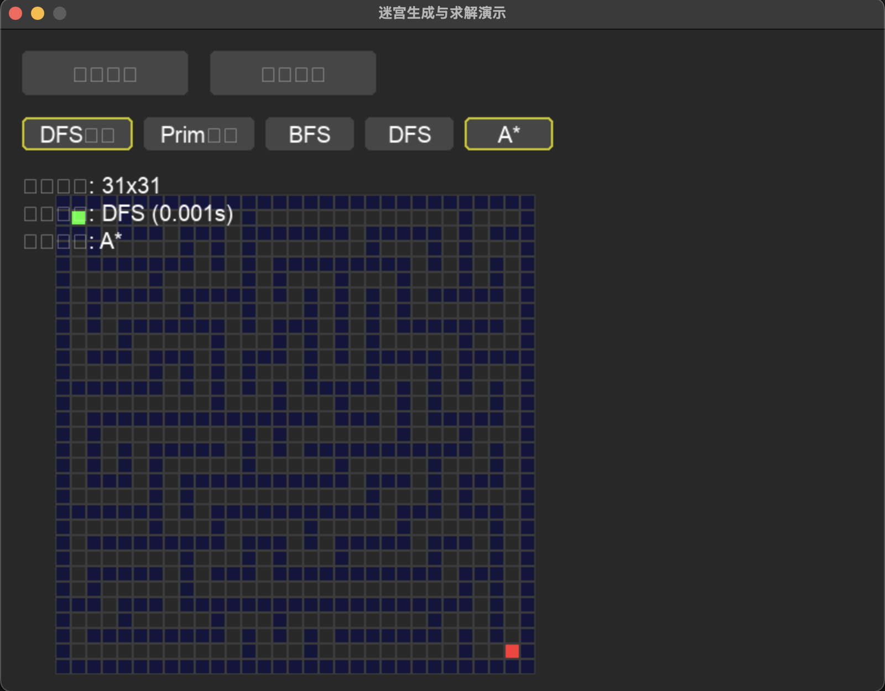

# Maze Generator & Solver

 

Python实现的迷宫生成与求解可视化工具

## 功能特性
- 支持DFS/Prim迷宫生成算法
- 支持BFS/DFS/A*路径求解算法
- 交互式Pygame可视化界面

## 快速开始
```bash
git clone https://github.com/qichen012/maze-project.git
cd maze-project
pip install -r requirements.txt
python demo.py